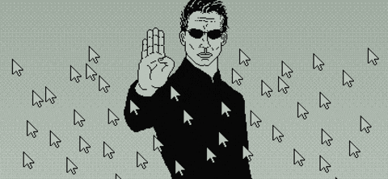

<!--
  GANTI "USERNAME" dengan username GitHub kamu.
  Letakkan foto kamu di folder assets/:
    - assets/neo-profile.jpg   (foto profil utama)
    - assets/neo-side.jpg      (foto kedua)
-->

```bash
root@matrix:~$ cat ~/neo/README.md
```

<div align="center">

[](https://github.com/USERNAME)

`FOLLOW THE WHITE RABBIT_ // PERSONAL FILE 001`


</div>

---

<table>
<tr>
<td width="220" align="center" valign="top">


`[ IDENTITY VERIFIED ]`

</td>
<td valign="top">

### `> ABOUT THE USER`

```text
Just a loser on the internet. Writing code, collecting
stories & escaping the simulation.
```

| `[ + ] LIKES` | `[ − ] DISLIKES` |
| :--- | :--- |
| action films, cats, fantasy, RPG's and TTRPGs | transphobes, pronatalism, bigots |

<sub>there is no spoon. &nbsp;·&nbsp; `[ ENCRYPTED // AES-256 ]`</sub>

</td>
</tr>
</table>

<table>
<tr>
<td width="50%" valign="top">

### `> BEFORE YOU FOLLOW`

```text
Transpositive and nonjudgmental. Not spoiler free about
anything I post about.
```

</td>
<td width="50%" valign="top">

### `> DON'T FOLLOW IF`

```text
Transphobe/TERF, manosphere "red-pilled", troll, bigot or
just hateful.
```

</td>
</tr>
</table>

<table>
<tr>
<td width="260" align="center" valign="top">


<br />

`[ FIND ME ON ]`

<a href="https://USERNAME.tumblr.com"></a>
<a href="https://twitter.com/USERNAME"></a>
<a href="https://tiktok.com/@USERNAME"></a>
<a href="https://instagram.com/USERNAME"></a>
<a href="https://github.com/USERNAME"></a>

<sub>"I think, therefore I code."</sub>

</td>
<td align="center" valign="middle">



</td>
</tr>
</table>

---

### `> MEANWHILE, IN THE SIMULATION...`

```bash
$ cat current_status.txt
Building little things for the web. Always learning.
```

<p>
  
  
  
  
  
</p>

**`GITHUB ACTIVITY`** <sub>— last 12 weeks</sub>


<sub>one commit at a time.</sub>

---

<div align="center">

### `take the red pill. stay curious.`


<br />

`YOU ARE VISITOR`


</div>
